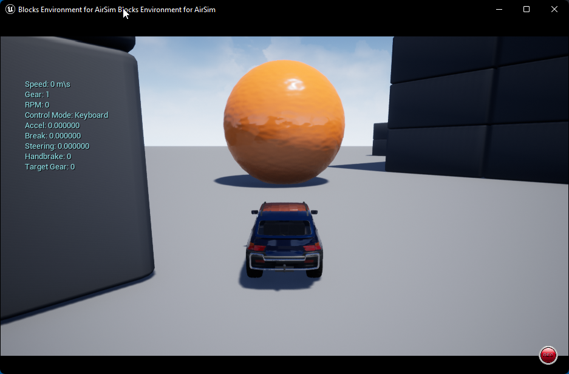

# An AirSim client library for NodejsS

Programmatically configure and control the [Microsoft AirSim](https://microsoft.github.io/AirSim/) 
simulation environment and hosted virtual cars and multirotor vehicles from a Nodejs app. The TypeScript
API is documented and super easy to use. To facilitate your learning a wide range of examples and AirSim
settings files is provided.


# Quick Start
You will need to have the Nodejs environment installed on your system to complete this Quick Start. 
See [here](https://docs.npmjs.com/downloading-and-installing-node-js-and-npm) for instructions.

## Step-1
Create and intialize a Nodejs TypeScript package. Begin by entering the following cmds from a shell: 
```
mkdir airsim-ping
cd airsim-ping
npm init -y
npm i airsim
npm i typescript @types/node --save-dev
npx tsc -init
```
## Step-2
Create a file named `ping.ts` and add the following code.
```typescript
// ping.ts - Runs AirSim ping command
import { AirSim } from '../src/airsim';
import { Vehicle } from '../src/vehicle';

async function main() {
  // create airsim client; assumes AirSim server is on localhost
  const airsim = new AirSim(Vehicle);
  
  let result = await airsim.connect();
  console.log('connected: ', result);

  console.log('Calling ping');
  result = await airsim.ping();
  console.log(`result: ${result}`);

  await airsim.confirmConnection();
  airsim.close();
}

main();
```
## Step-3
Compile ping.ts
```
npx tsc
```
## Step-4
Next start up an AirSim environment on localhost, e.g., Blocks.
You can find prebuilt AirSim binaries (Win,Linux) [here](https://github.com/Microsoft/AirSim/releases).

## Step-5
Run ping.js
```
node ping.js
```
Your output should be similar to this:
```
$ node ping.js
connected:  true
Calling ping
result: true
Connected!
Client Ver: 1 (Min Req: 1)
Server Ver: 1 (Min Req: 1)
```

Bingo! you've just developed your first AirSim client application.

See the wide range of exmples on github.

# API
The majority of the AirSim api is Promise-based as communications with
an AirSim server is via msgpack-rpc over a TCP socket. The main components
you'll work with and their relationships are shown below.
```

    AirSim ---uses---> Vehicle
      |                /   ^
     uses             / inherits
      v              /     |
   Session<---uses--/   --------
                        |      |
                       Car  Multirotor
```

### AirSim
The AirSim class is the main entry point to the package. It creates and manages a Session and Vehicles instances. Use the AirSim class to access and control an AirSim environment such as the time-of-day, pause/step/resume, session recording, weather, external cameras, and dynamically add and delete vehicles and draw lines, arrows, messages and transforms.

**AirSim Constructor**   
An AirSim environment host only Car or Multirotor vehicles, never both simultaneously. Therefore the `AirSim()` constructor requires that you provide a Vehicle type parameter so that `getVehciles()` 
knows the proper type of Vehicle to construct and return.

Examples:
```typescript
  // minimal parameters, default IP (localhost) and port (41451)
  let airsim = new AirSim(Vehicle);
  let airsim = new AirSim(Car);
  let airsim = new AirSim(Multirotor);

  // localhost, custom port
  let airsim = new AirSim(Car, 80);

  // remote server, default port
  let airsim = new AirSim(Multirotor, undefined, '172.21.96.1');

  // remote server, custom port and IP
  let airsim = new AirSim(Vehicle, 80, '172.21.96.1');
```

### Session
The Session class is a gateway for converting API function calls into msgpack-rpc requests/response over a TCP connection with an AirSim server. In general you will not need to directly interact with Session. This class is patterned
after the [AirSim Python client](https://github.com/microsoft/AirSim/blob/master/PythonClient/airsim/client.py). When needed use the low-level Session `_call()` method to interact directly at the msgpack-rpc layer.

### Vehicle
The Vehicle class provides the common properties and behaviors for all AirSim vehicles such as a unique name,api control, 
pose and location, sensor data access, collision detection, camera access and control, 

**NOTE**
When accessing a vehicle's cameras with `getCameraInfo(cameraName)`, only use valid camera names. Otherwise typically results in the AirSim environment crashing. Use `Vehicle.getDefaultCameraNames()` for a list of valid camera names. 

### Car
The Car class extends Vehicle with API for accessing a car's state
and controlling its movement. Additionally can create
new Car instances and dynamically add them to an AirSim environment. Key classes for working with cars are `Car`, `CarState`, `CarControl` and `CameraInfo`.

 
### MultiRotor, aka Drone
The Multirotor class extends Vehicle with API for accessing a drone's state and controlling its movement. High-level 
command/control api include: `takeoff()`, `hover()`, 
`moveToPosition()`, `goHome()` and `land()`.

Similar to Car, a multirotor instance can be created dynamically and added to an AirSim environment. Key classes when working with multirotors incldue
`Multirotor`, `MultirotorState`, `RotorStates`, `Camera`.

# Examples, How-To's, FAQ

See the [AirSim-Node wiki](https://github.com/ros2jsguy/airsim-node/wiki) for additional information.


# Team
Please connect with me on Twitter [@ros2jsguy](https://twitter.com/ros2jsguy) & [https://medium.com/@ros2jsguy](https://medium.com/@ros2jsguy)
